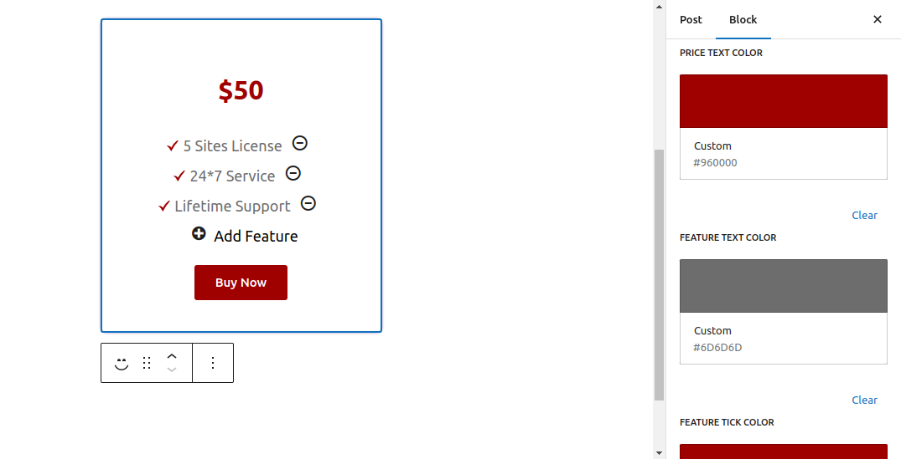

# Gutenberg Block Pricing Table
- Use this Gutenberg Block to add pricing table on your page/ post.
- It also provides the settings to change the price color, list item colors and CTA button colors.

## The following files are being used for all plugin functionalities
```
├── build
│   ├── block.json
│   ├── index.asset.php
│   ├── index.css
│   ├── index.js
│   └── style-index.css
└── shailesh-gutenberg-blocks.php
```

<hr />
<h4>Steps</h4>
<hr />

*Step 1 - Go to Post Edit Page*

*Step 2 - Search the Gutenberg block Pricing Table and include it in the Post*

*Step 3 - Configure the Pricing Table block as per your requirement*


*Step 4 - That's it. View Your Pricing Table on the Post*

